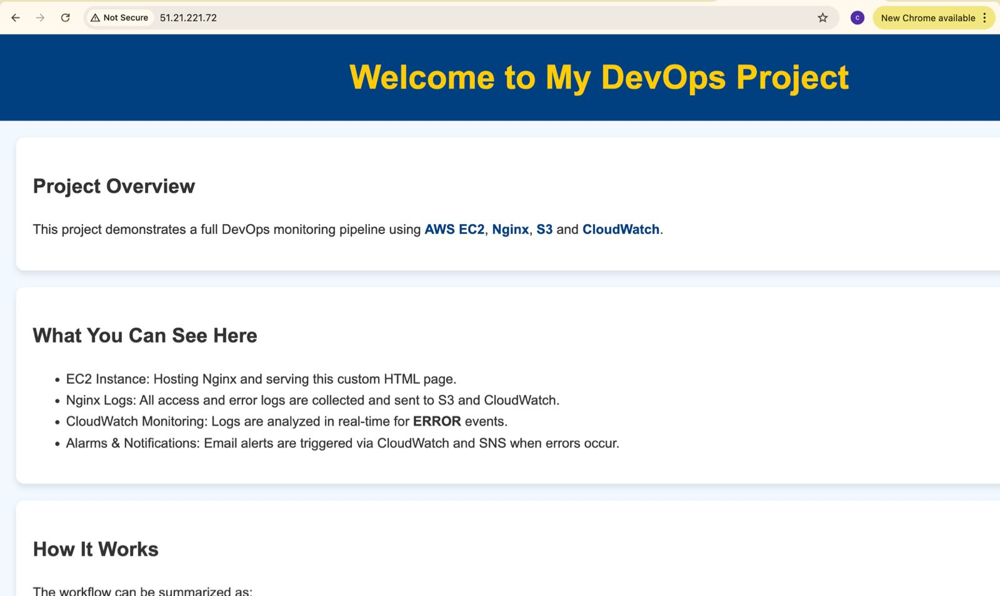
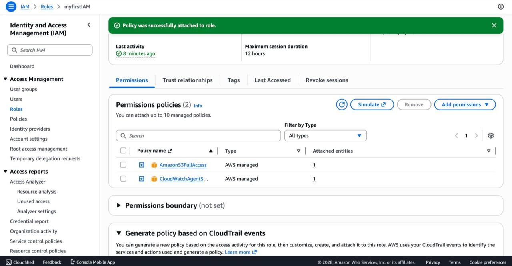
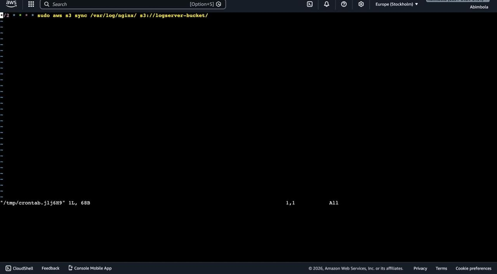
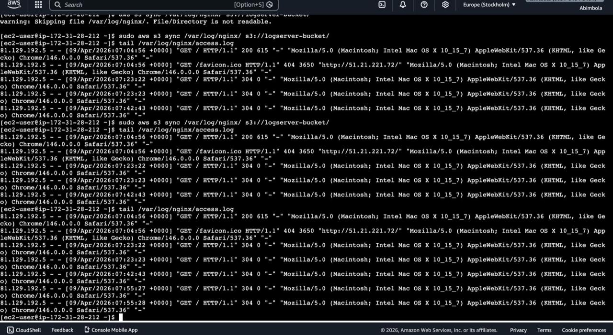
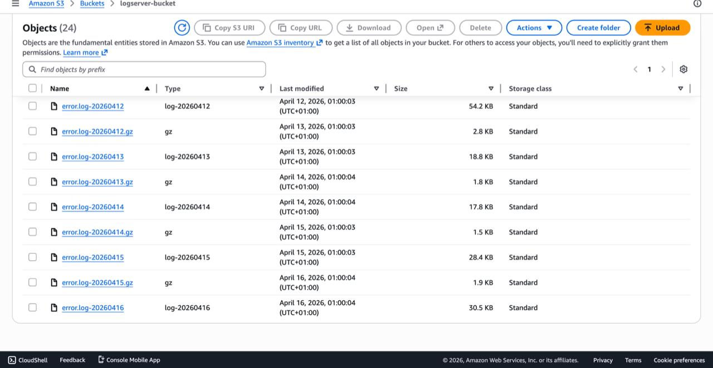
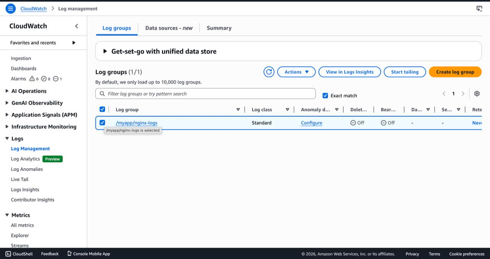
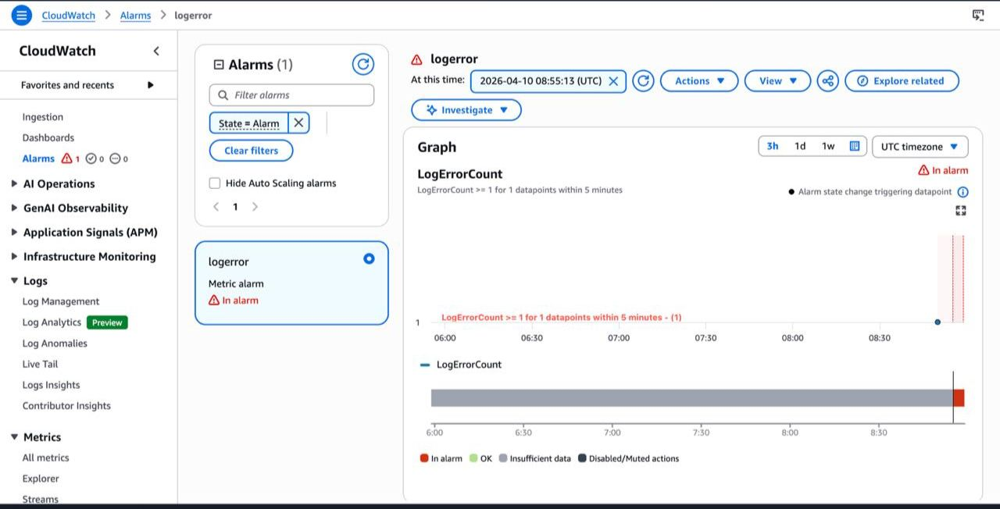
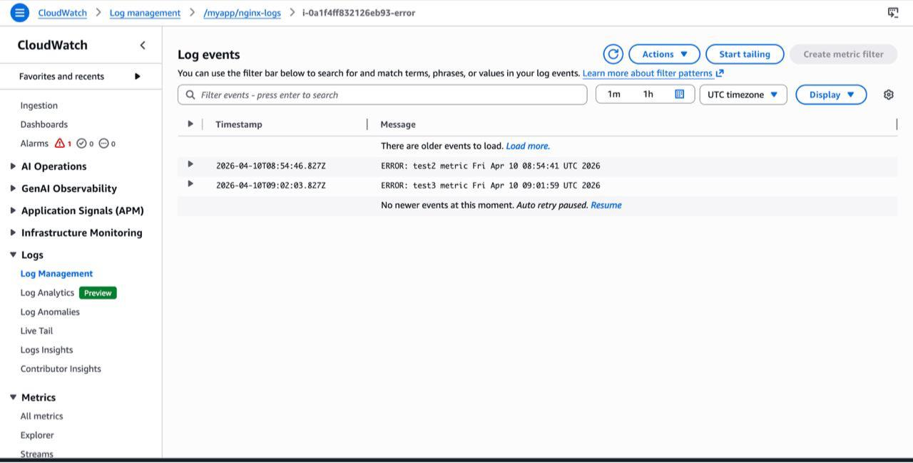
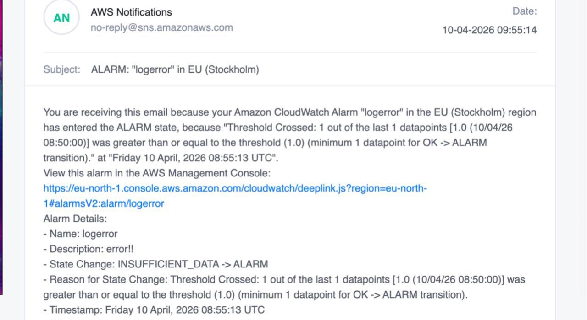

# Server link - http://51.21.221.72/

## Project -: Automated Application-Logging and Monitoring System

## Step 1 : I created an EC2 instance using the AWS console.
## Step 2 : I Connected to the server using AWS CLI and installed nginx and updated the index page using nano.

## Step 3 : I configured an IAM role to grant the EC2 instance permission to access S3 securely.

## Step 4 : I created an S3 bucket to serve as centralized storage for logs, where the EC2 instance automatically uploads logs using a cron job.
- I created an s3 bucket.
- I automated the logs to store in s3 using cronjob.
- I updated the crontab with a script that upload the log on s3 every 2 minutes using nano as text editor.

## Step 5 : I innitiated traffic on my server to test the logs and confirm that Logs are being backedup on my s3 bucket.
- I synced my ec2 server to s3.
- Using tail command I checked that logs are being updated sucessfully.
- Also checked s3 Bucket to confirm logs are being automatically on the console.
- As there were no error logged from my server, to test I manually updated the error log file to test that possble error will be stored on s3.

## Step 6 : Launched a CloudWatch to watch for log errors (ERROR, CRITICAL) and triggers alarms.
- Via the AWS CLI I installed cloudwatch and created a watch for the nginx logs in my ec2 server.
  - sudo yum install amazon-cloudwatch-agent -y
  - sudo /opt/aws/amazon-cloudwatch-agent/bin/amazon-cloudwatch-agent-config-wizard
  - sudo systemctl start amazon-cloudwatch-agent
  - sudo systemctl enable amazon-cloudwatch-agent
- Using the AWS console I created a metric filter on the log group and set a filter pattern to check ERRORS and assigned a metric name "logerror ".

## Step 7 : Created a notification system: SNS sends email/SMS alerts when errors or suspicious events occur.
- I created an Alarm by first choosing the metric I created from the previous step.
- I set a threshold counter of >= 1 in every five minutes.
- I created an SNS topic for the notification, provided an email and subscribed. 
- To test, I encoded an error to my log and I recieved an alarm notification in my inbox.

## Challenges
- Created a folder to copy nginx logs, but this created a rigid and longer workflow where I had to copy first, then sync to s3.
  - Solution : 
     - I discovered that Nginx already writes logs directly to its default log files (access.log and error.log) in /var/log/nginx/.
     - Instead of copying the logs, I updated my workflow to sync directly from the Nginx log directory to S3.
     - This eliminated the extra step, simplified the process, and made the pipeline more efficient.

