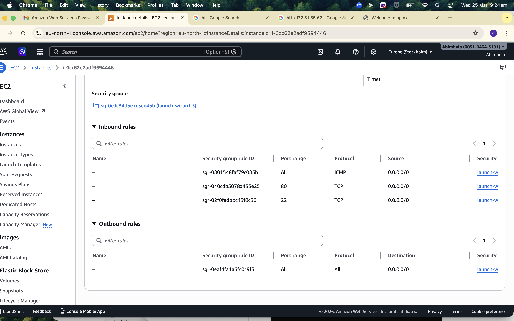
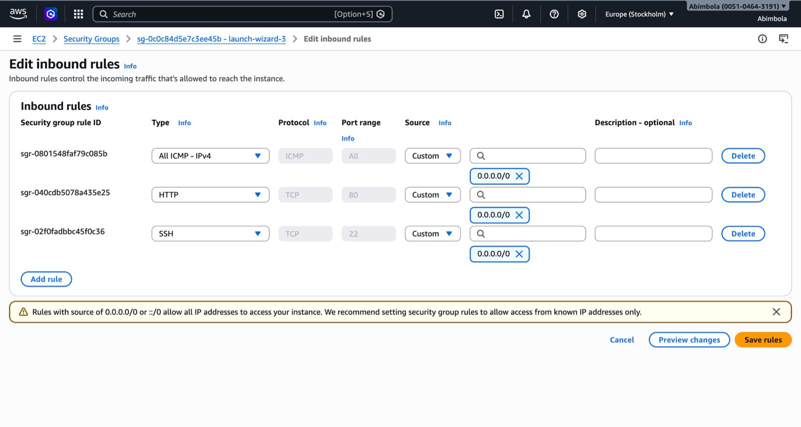
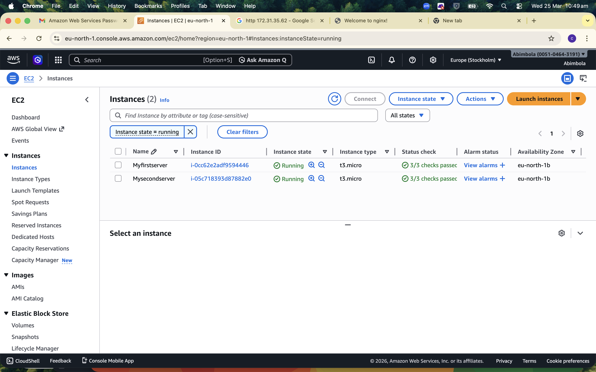
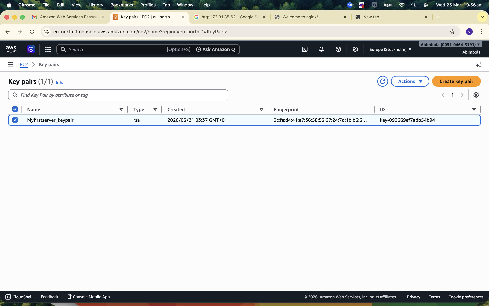
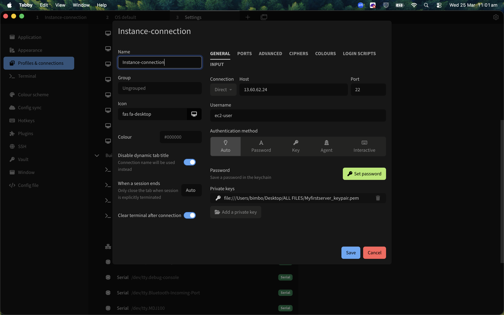
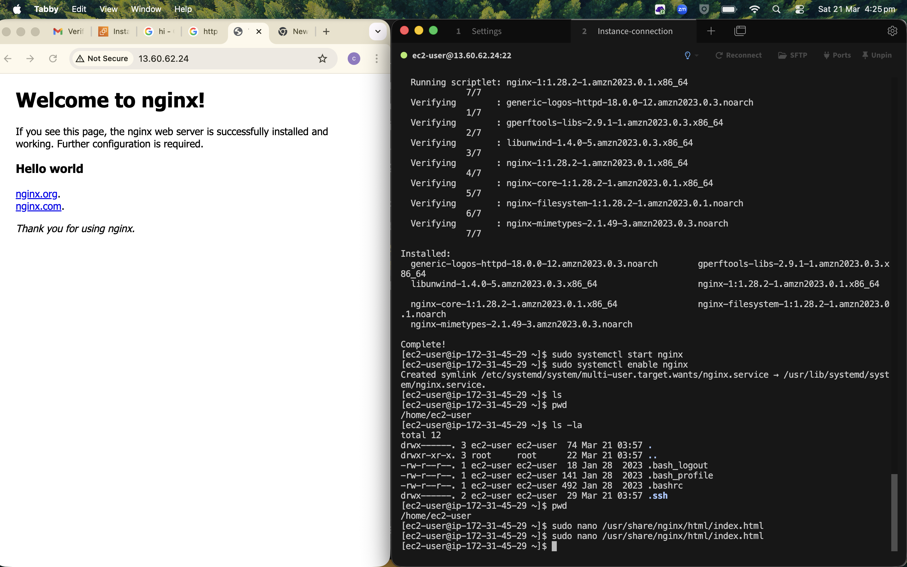
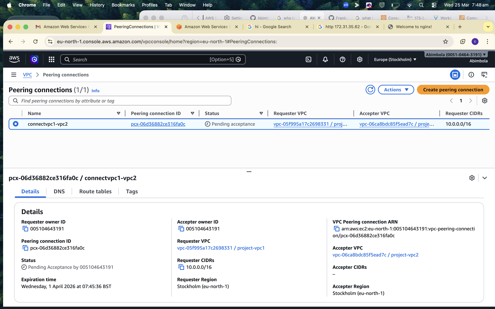
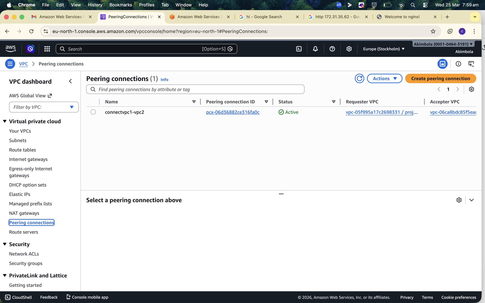

# Task

1. I created an EC2 instant and named it "myfirstserver", with t2.micro instance type, selected Amazon linux as the OS, practiced the possible actions, restart, delete, terminate and was able to filter based on the actions. 

2. I edited the security group to and added to allow traffic from SSH and ICMP protocol. 

3. I repeated step 1 and 2 to create the second EC2 instance and named it "myfirstserver2", such that I now have two EC2 instances

4. I ensured the two instances share the same key-pair value 

5. I lauched and formatted a virtual terminal to connect through ssh

