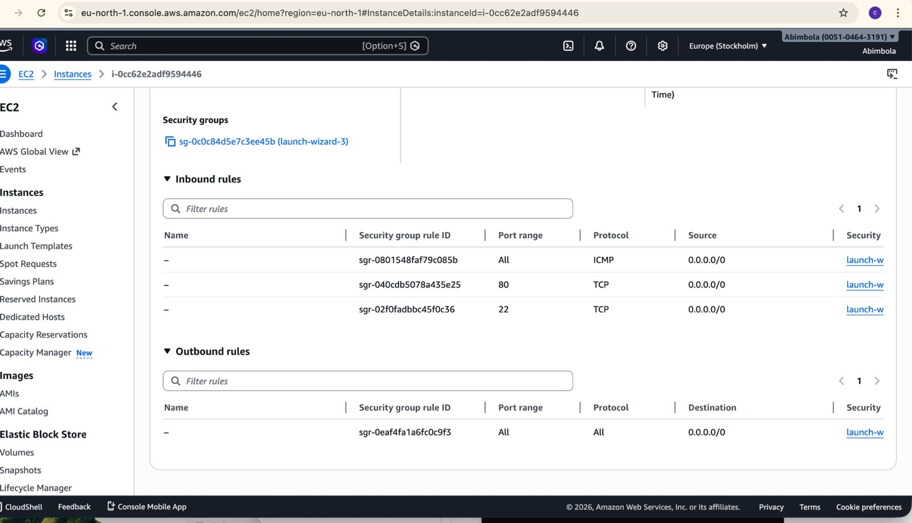
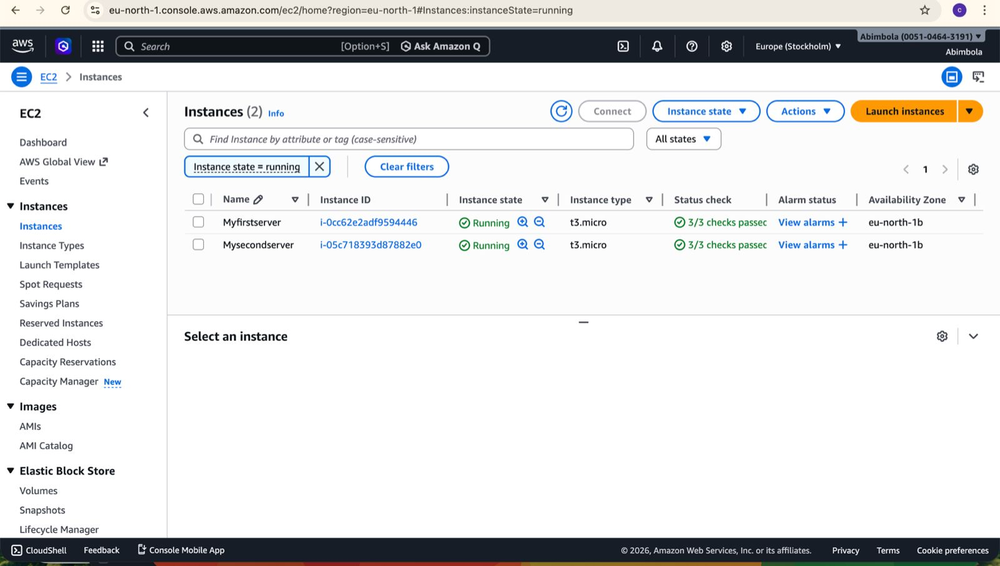
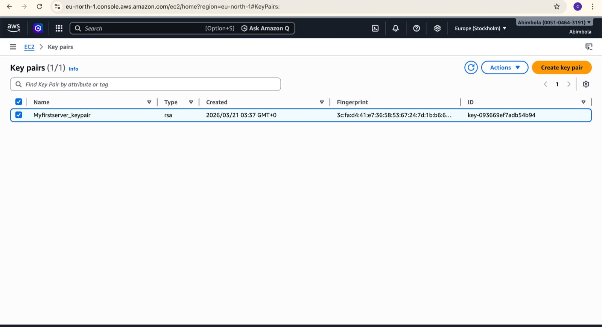
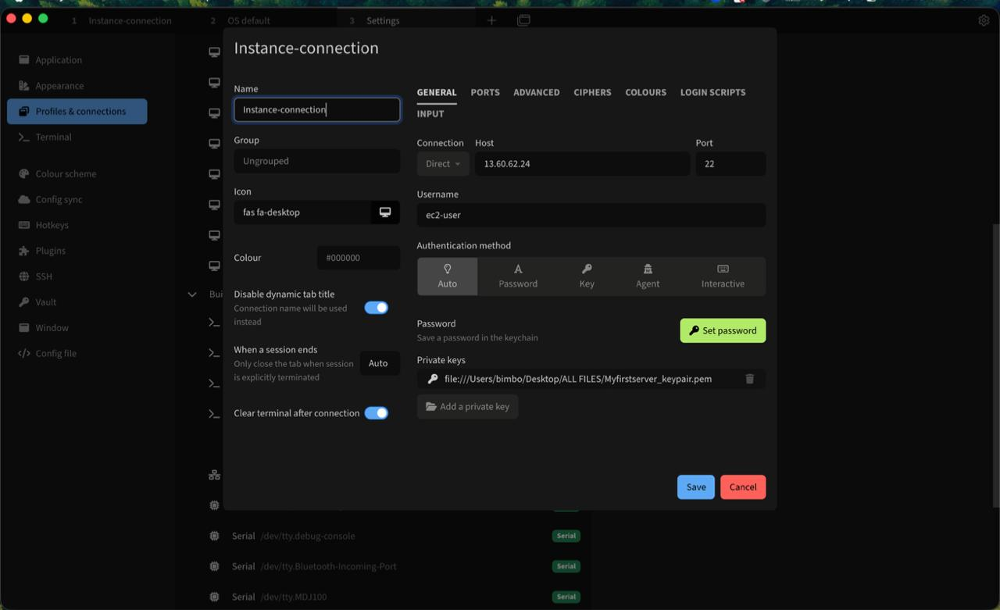
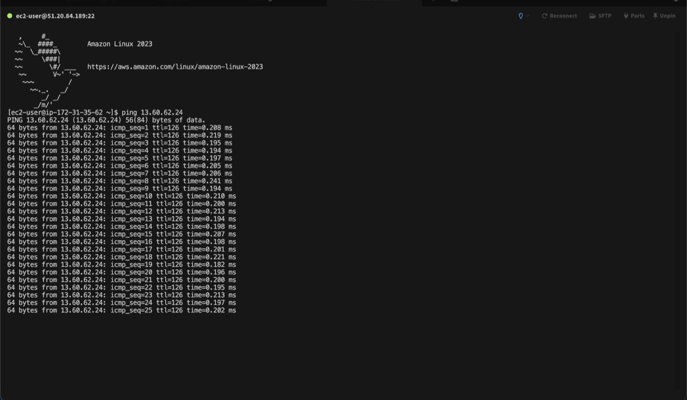
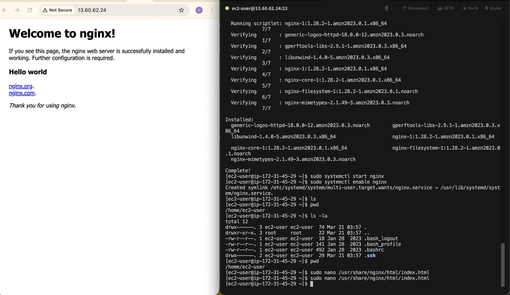
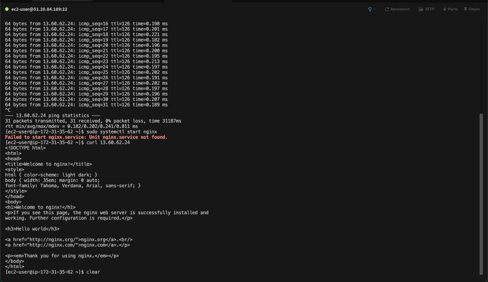
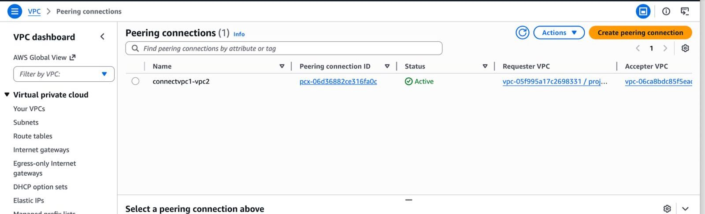
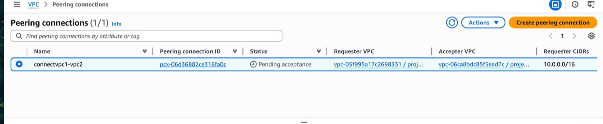
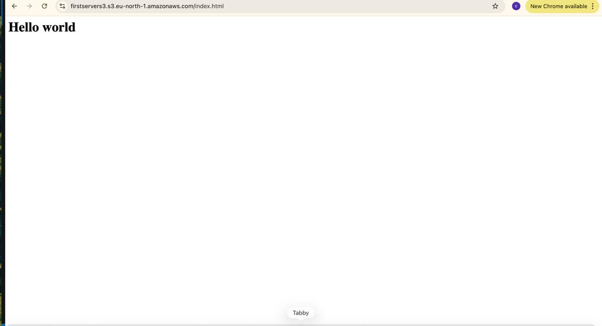

# Task

## Step 1. I created an EC2 instant and named it "myfirstserver", with t2.micro instance type, selected Amazon linux as the OS, practiced the possible actions, restart, delete, terminate and was able to filter based on the actions. 

## Step 2. I edited the security group to and added to allow traffic from SSH and ICMP protocol. 

## Step 3. I repeated step 1 and 2 to create the second EC2 instance and named it "myfirstserver2", such that I now have two EC2 instances. However, the second instance is launched on Ubuntu AMI.

## Step 4. I ensured the two instances share the same key-pair value to allow connection.

## Step 5. I launched and formatted a virtual terminal for instances to connect through ssh

## Step 6. I then checked connection by pinging from one instance to another

## Step 7. I installed web server (nginx/apache) to the first instance and I created web page with text “Hello World” and information about OS version;

 ## Step 8. I ensure that in instance without nginx/apache I can see “Hello world” from instance with nginx/apache.

 

## EXTRA STEPS

## Step 1. I recreated step 3 to 6, by creating instances in seperate VPC.

## Step 2. I created an s3 bucket and made the object publicly accessible using aws policy json.

